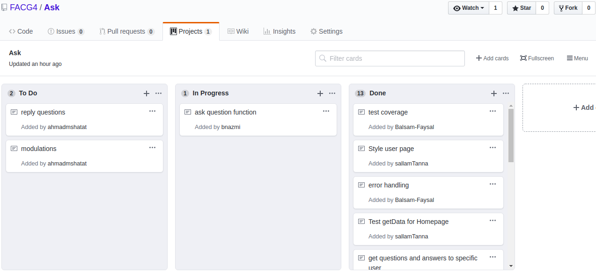

# Ask :sparkles:
 By:&nbsp;&nbsp;&nbsp;
  Abdullah:small_orange_diamond:Ahmed:small_orange_diamond:Balsam:small_orange_diamond:Sallam    </b>
  
To see the webpages, [CLICK HERE](https://ask-app-saba.herokuapp.com/)
### WHY :question:
Simple web page that allows users to ask some other users questions.
### WHAT & HOW:question:
We created this web page to apply what we have studied during this week. So this is what we did:
* Created all the files required to run the database.
* Created the functions required to get data from database and post(insert) data into database.
* Created html files to dislay the selected data, and allow users to post data to database.
* Funally, we added some simple style.

&nbsp;
&nbsp;
###### The following image represents the database that we use in our project:

###### The following image represents the flow that we followed during our work on this project. We divided the work between two pairs(Ahmed & Abdullah) and (Sallam & Balsam).

&nbsp;
